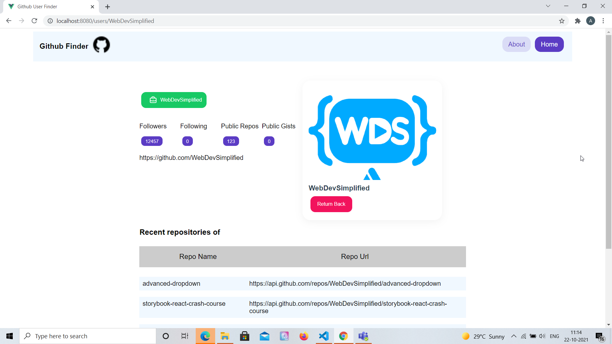

# Github User Finder App - Vue JS and Vuesax ⚡️

## Project Briefing

Inspired by the Github Finder app written by Brad Traversy in React. This is the Vue version of the app with pretty much the same features as the one created by Brad here [Github Finder by Brad Traversy](https://github.com/bradtraversy/github-finder). This uses Vuesax UI library in Vue for UI components.

Made with ❤️ by **[@apfirebolt](https://github.com/Apfirebolt/)**
## Features

- Makes use of Github public API to search for users and repositories on Github. 
- Github Search User functionality is provided.
- Search detail results is available for each user where you can see various details of the user and the recent repositories on which the user has worked on.
- Vuesax components used for Cards, Buttons, Grids and More in this app. 

## Built With

* [Vue](https://vuejs.org//)
* [Vuesax](https://vuesax.com//)

## Project setup

Simply install node modules for the app and run the serve script.

```
npm install
npm run serve
```

For production, run the build npm command and serve the static files through a production or development server.

```
npm run build
npm start
```

## Project Screenshots

Please find some of the screenshots of the application. Below is the screenshot of the Search Page.


Screenshot of the user detail page where you can view Github user details of a user and the repositories they've worked on most recently.



