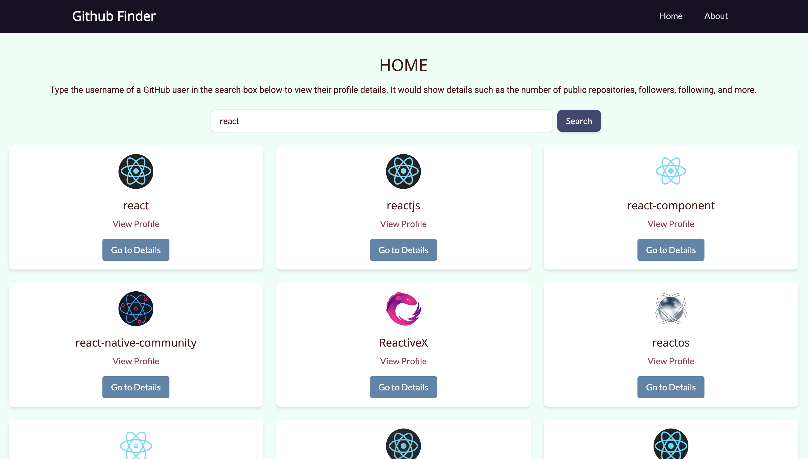
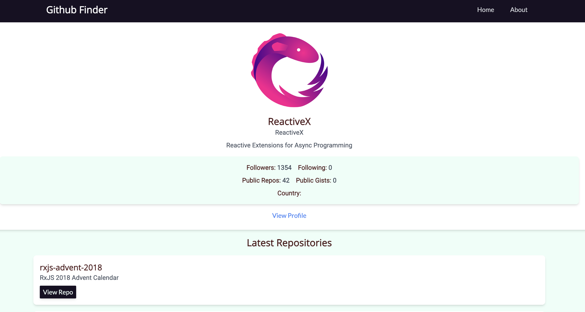

# Github User Finder App - Vue 3, Tailwind and Headless UI  ⚡️


## Project Briefing


Inspired by the Github Finder app written by Brad Traversy in React. This is the Vue version of the app with pretty much the same features as the one created by Brad here [Github Finder by Brad Traversy](https://github.com/bradtraversy/github-finder). This uses Headless UI library in Vue 3 for UI components. It uses Tailwind CSS framework with custom theme colors.

Contrary to some of my other Vue 3 projects, this project uses the old school options API. 

It is available for demonstration at https://vue-github-finder-sigma.vercel.app

Made with ❤️ by **[@apfirebolt](https://github.com/Apfirebolt/)**

## Features

- Makes use of Github public API to search for users and repositories on Github. 
- Github Search User functionality is provided.
- Search detail results is available for each user where you can see various details of the user and the recent repositories on which the user has worked on.
- Headless UI components used for Cards, Buttons, Grids and More in this app. 
- Dark Mode available

## Project Screenshots

Please find some of the screenshots of the application. Below is the screenshot of the Search Page.



Screenshot of the user detail page where you can view Github user details of a user and the repositories they've worked on most recently.



## Built With

* [Vue](https://vuejs.org//)
* [Tailwind CSS](https://tailwindcss.com/)
* [Headless UI](https://headlessui.dev/)
* [Docker](https://www.docker.com//)

## Project setup

Simply install node modules for the app and run the dev script. This makes use of Vite for superfast build process.

```
npm install
npm run dev
```

For production, run the build npm command and serve the static files through a production or development server.

```
npm run build
npm start
```

## Docker deployment instructions

Docker container based systems make it easy for you to deploy production ready apps with few one liners. Make sure you have Docker installed on your system. Build an image from the existing Docker file inside this repo. 

```
sudo docker build . -t vue-github
sudo docker run --detach -p 80:80 vue-github
```

- First command would create an image from the existing docker file, image would be tagged by name 'vue-github' for identification. If this is skipped, then image would be created with an ID which would be hard to identify.
- Second step would create a container from the image and run it on port 80 on your system.
- Make sure there are no servers running on your system like nginx and/or Apache. Docker script is configured to serve the build through Nginx on port 80.
- detach flag is used to indicate that this process would be running in background in non-interactive mode.

## Kubernetes Deployment

Create an image locally with your docker-hub username followed by the name of the image. Here's the example :-

```
docker tag github-finder aspper/github-finder
docker push aspper/github-finder
```
First command would change the tag of the image "github-finder" which was already existing in my case to "aspper/github-finder"

The second line would push the image on Docker hub which would be publicly accessible by anyone. Use the following Deployment file to spawn 2 pods using this image

``` YAML
apiVersion: apps/v1
kind: Deployment
metadata:
  name: github-deployment  # Name for your deployment
spec:
  replicas: 2  # Number of pods (2 in this case)
  selector:
    matchLabels:
      app: github-deploy  # Label to identify pods belonging to this deployment
  template:
    metadata:
      labels:
        app: github-deploy  # Labels for the pods in the deployment
    spec:
      containers:
      - name: new-github-finder  # Container name
        image: aspper/github-finder:latest  # Your image reference
        # Add any container specific configurations here (e.g., ports, resources)
        ports:
        - containerPort: 80  # Port your application listens on

```

Deploy the pods inside a deployment using the command

```
kubectl apply -f github-deployment.yaml
```

Access using port forwarding using the command

```
kubectl port-forward github-deployment-57b4587c56-46b9v 8080:80
```

Now open port 8080 on your browser, you should be able to see the application in action. This is a widely adopted approach for testing kubernetes deployment before shipping to production.

## Contribute

We welcome contributions to enhance the functionality and features of this project. To contribute, please follow these steps:

1. **Fork the repository**: Click on the 'Fork' button at the top right corner of this repository page to create a copy of this repository in your GitHub account.
2. **Clone the repository**: Clone the forked repository to your local machine using the following command:
    ```
    git clone https://github.com/apfirebolt/vue-github-finder.git
    ```
3. **Create a new branch**: Create a new branch for your feature or bug fix:
    ```
    git checkout -b feature-name
    ```
4. **Make your changes**: Implement your feature or fix the bug in your branch.
5. **Commit your changes**: Commit your changes with a descriptive commit message:
    ```
    git commit -m "Description of the feature or fix"
    ```
6. **Push to your fork**: Push your changes to your forked repository:
    ```
    git push origin feature-name
    ```
7. **Create a Pull Request**: Open a pull request from your forked repository to the main repository. Provide a clear description of your changes and the problem they solve.

We will review your pull request and provide feedback. Once approved, your changes will be merged into the main branch.

Thank you for your contributions!

